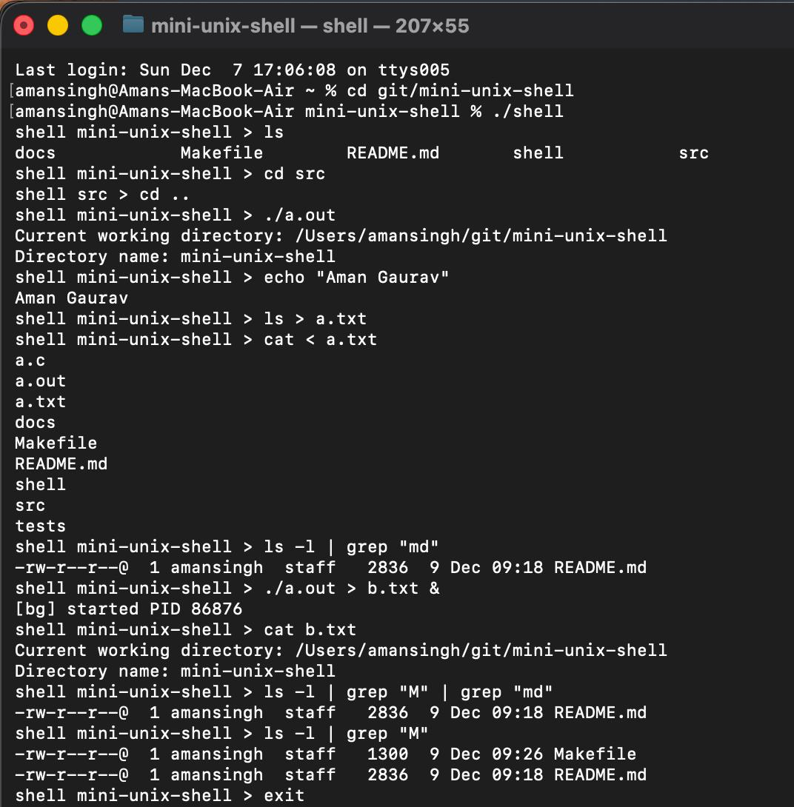
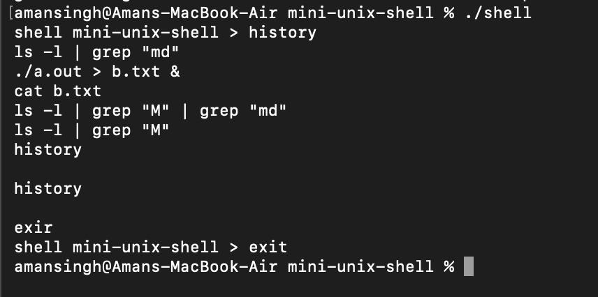
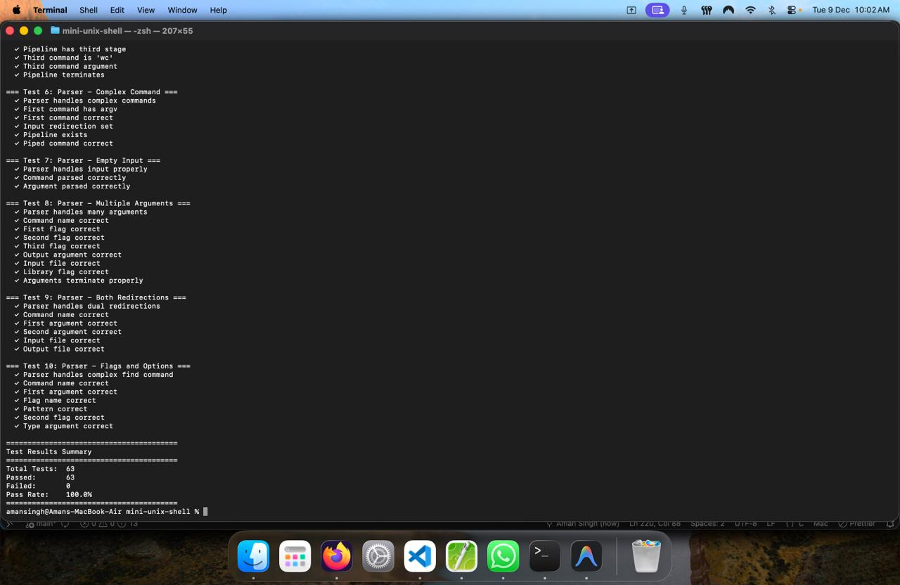

# Mini UNIX Shell - User Documentation

**Version:** 1.0  
**Date:** December 9, 2025  

---

## 1. Introduction

The **Mini UNIX Shell** is a custom command-line interface (CLI) designed to provide a lightweight environment for interacting with POSIX-compliant operating systems. It supports essential shell features such as command execution, input/output redirection, pipelines, and background process management.

### Supported Platforms
* **Linux** (Ubuntu, Debian, Fedora, etc.)
* **macOS** (Requires Xcode Command Line Tools)
* **Windows** (via Windows Subsystem for Linux - WSL)

---

## 2. Installation and Setup

### Linux

1.  **Install dependencies** (Ubuntu/Debian example):
    ```bash
    sudo apt update
    sudo apt install build-essential
    ```
2.  **Build**:
    ```bash
    make
    ```
3.  **Run**:
    ```bash
    ./shell
    ```

### macOS

1.  **Install Command Line Tools** (if not already installed):
    ```bash
    xcode-select --install
    ```
2.  **Build**:
    ```bash
    make
    ```
3.  **Run**:
    ```bash
    ./shell
    ```

### Windows

**Note**: This shell relies on POSIX system calls (like `fork()`, `pipe()`, `execvp()`) which are not natively available in the Windows kernel. You **must** use the Windows Subsystem for Linux (WSL).

1.  **Install WSL**:
    Open PowerShell as Administrator and run:
    ```powershell
    wsl --install
    ```
    Restart your computer if prompted.
2.  **Open WSL Terminal**:
    Launch "Ubuntu" (or your installed distribution) from the Start menu.
3.  **Install dependencies**:
    ```bash
    sudo apt update
    sudo apt install build-essential
    ```
4.  **Build and Run**:
    Navigate to the project directory and run:
    ```bash
    make
    ./shell
    ```


**Clean Build (Optional)**: To remove compiled object files and the executable, run:
    ```bash
    make clean
    ```

---

## 3. Getting Started

To start the shell, execute the binary generated in the previous step:

```bash
./shell
```
Once started, you will see a prompt displaying your current working directory:
```bash
shell mini-unix-shell >
```
You can now type commands just as you would in a standard terminal.

## 4. Features and Usage
### 4.1. Basic Command Execution

The shell can execute any external program available in your system's PATH (e.g., ls, grep, mkdir).

Example:

```bash
shell > ls -la
```

### 4.2. Built-in Commands
The shell includes specific commands that are handled internally rather than by external programs.

`cd [directory]`: Changes the current working directory.

If no directory is specified, it defaults to the user's HOME directory.

Example: `cd ..` (Move up one directory).

`exit`: Terminates the shell session.

### 4.3. Input and Output Redirection
You can control where commands read input from and where they write their output using standard redirection operators.

Output Redirection (>): Writes the output of a command to a file. If the file does not exist, it is created. If it exists, it is overwritten.

Syntax: `command > filename`

Example: `ls > files.txt`

Input Redirection (<): Reads input for a command from a specified file.

Syntax: `command < filename`

Example: `sort < names.txt`

### 4.4. Pipelines
Pipelines allow you to chain multiple commands together. The output of the first command becomes the input of the second command.

Syntax: `command1 | command2`

Example: `ls -l | grep ".c"` (Lists only files ending in .c).

Advanced: You can chain multiple pipes: `cat file.txt | grep "search" | wc -l`.

### 4.5. Background Execution
To run a command without blocking the terminal (allowing you to continue typing commands immediately), append an ampersand (&) to the command.

Syntax: command &

Example: `sleep 10 &`

Note: The shell will print a confirmation (e.g., [bg] started PID 1234).

## 5. Troubleshooting

| Issue | Possible Cause | Solution |
| :--- | :--- | :--- |
| **`make: command not found`** | Build tools missing. | Install `build-essential` (Linux) or Xcode CLI tools (macOS). |
| **`cd: No such file...`** | Invalid directory path. | Check the path spelling using `ls`. |
| **Shell ignores `Ctrl+C`** | Design choice. | The shell is designed to ignore SIGINT. Use `exit` to quit. |
| **Pipeline errors** | Syntax error. | Ensure spaces exist between commands and the `pipe` symbol. |

## 6. Demo Screenshots





